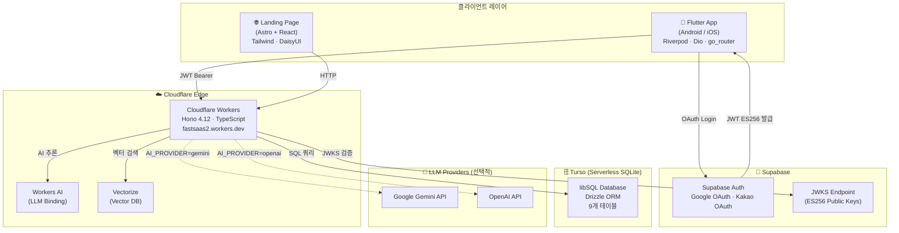
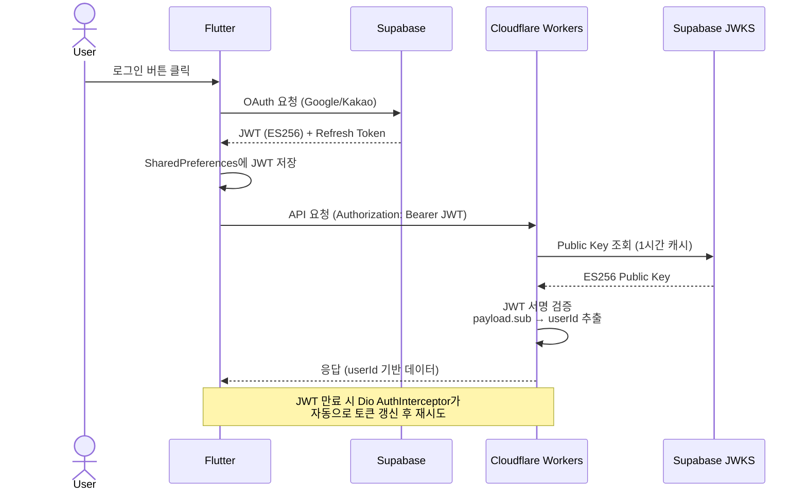
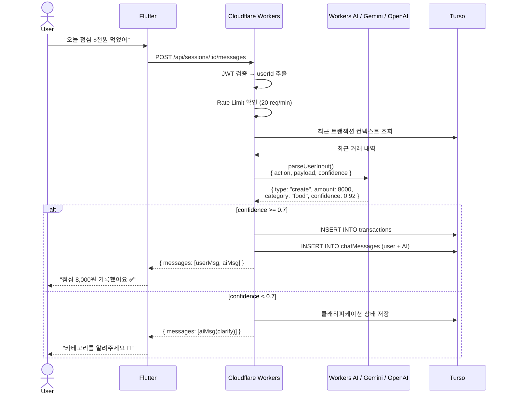
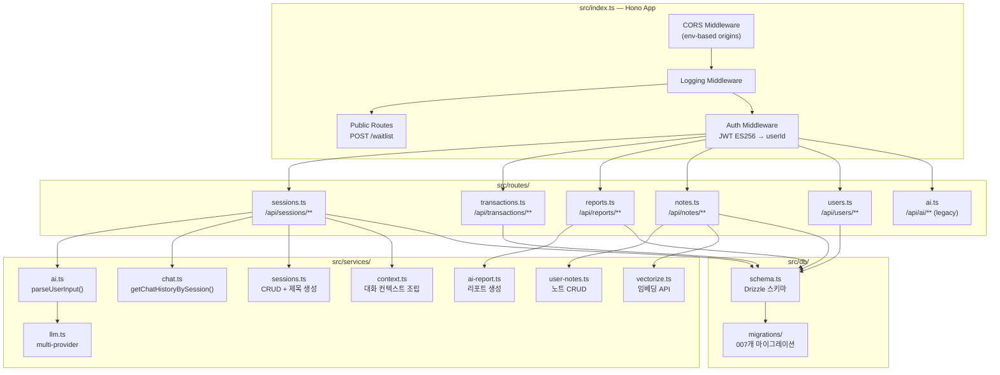
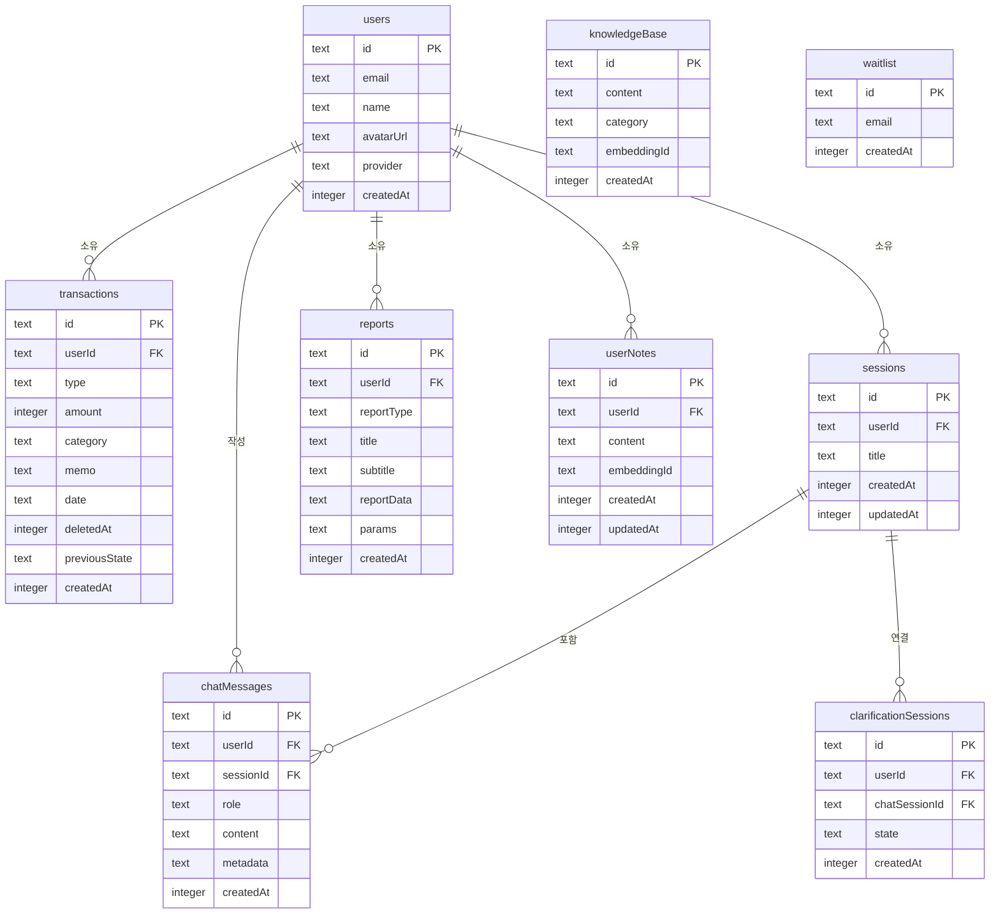
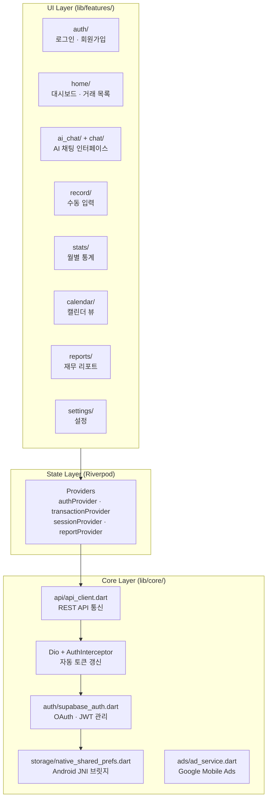
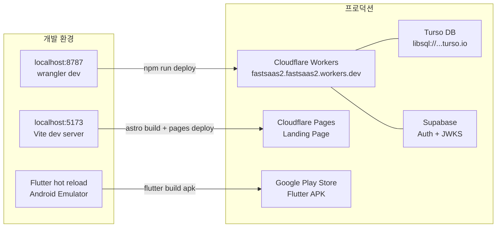
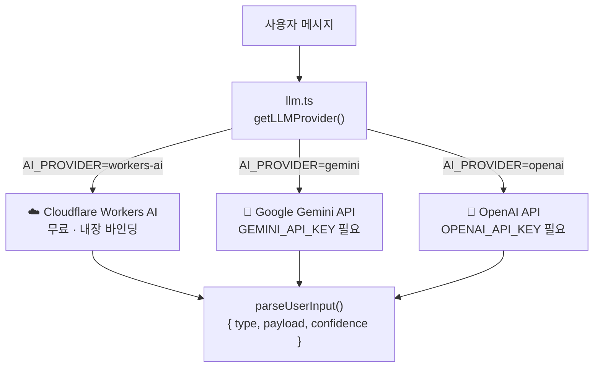
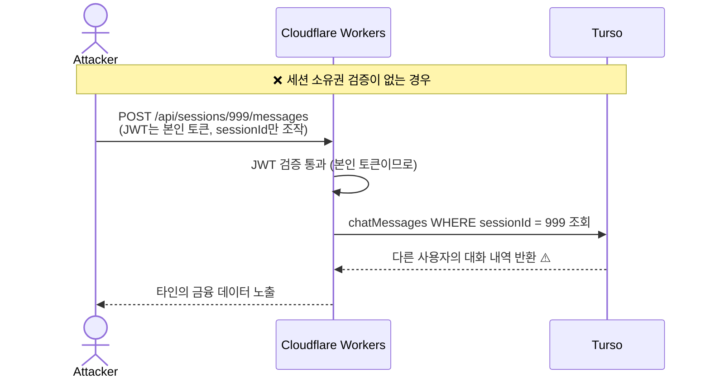
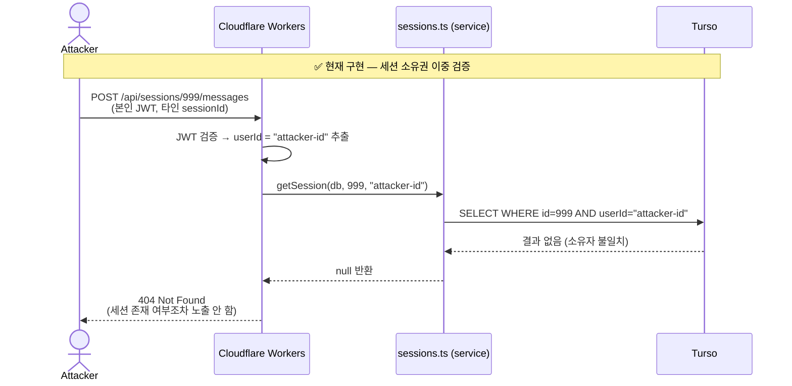

# FastSaaS 전체 시스템 아키텍처

> AI 기반 개인 금융 챗봇 — Flutter + Hono + Cloudflare Workers + Turso + Supabase

---

## 1. 전체 시스템 개요



---

## 2. 인증 흐름 (Auth Flow)



---

## 3. AI 트랜잭션 처리 흐름



---

## 4. 백엔드 내부 구조 (Cloudflare Workers)



---

## 5. 데이터베이스 스키마 (Turso / libSQL)



---

## 6. Flutter 앱 아키텍처



---

## 7. 배포 구성



---

## 8. LLM 멀티 프로바이더 구조



---

## 9. 보안 레이어

| 계층 | 보안 조치 |
|------|----------|
| **인증** | Supabase JWT ES256 서명 검증, JWKS 1시간 캐시 |
| **인가** | 모든 DB 쿼리에 `userId` 필터 강제 (`WHERE userId = ?`) |
| **세션** | 쓰기 전 세션 소유권 확인 (`getSession(db, sessionId, userId)`) |
| **Rate Limit** | AI 엔드포인트 20 req/min, 리포트 10 req/min (per-user) |
| **입력 검증** | Zod 스키마로 모든 API 요청 검증 |
| **CORS** | 환경변수 기반 허용 오리진 화이트리스트 |
| **Semgrep** | 하드코딩 시크릿·SQL 인젝션·eval 사용 정적 분석 |

---

## 10. 세션(Session)의 보안적 역할

세션은 단순한 "대화 그룹핑" 기능이 아닙니다. 아래와 같이 인증·인가·무결성의 핵심 경계선으로 동작합니다.

### 10.1 세션이 없을 때 발생하는 보안 공백



JWT가 유효하더라도, `sessionId`는 URL 파라미터로 공격자가 임의 조작 가능합니다. 세션 소유권 검증(`getSession(db, sessionId, userId)`)이 없으면 **Insecure Direct Object Reference(IDOR)** 취약점이 됩니다.

### 10.2 실제 방어 흐름



`404`를 반환하는 이유: `403 Forbidden`은 세션이 존재하지만 권한이 없음을 암시하여, 공격자가 유효한 세션 ID를 열거(enumeration)하는 데 활용될 수 있기 때문입니다.

### 10.3 세션이 보호하는 세 가지 기능

| 기능 | 세션 없이는? | 세션이 있으면? |
|------|------------|--------------|
| **메시지 조회** | `userId`만으로 전체 메시지 노출 가능 | `sessionId + userId` 이중 키로 최소 권한 접근 |
| **undo** | "어느 대화의 최근 액션인지" 특정 불가 → 타인 데이터 rollback 위험 | 세션 범위 내 최근 AI 메시지만 역추적, 범위 이탈 불가 |
| **clarification 상태** | 진행 중인 입력 상태를 사용자 전역으로 관리 → 세션 간 오염 | `chatSessionId`로 격리, 다른 세션의 미완료 입력이 간섭 불가 |

### 10.4 코드 레벨 보안 불변식

```typescript
// routes/sessions.ts — 모든 쓰기 작업 전 반드시 실행
const session = await getSession(db, sessionId, userId); // userId는 JWT에서만 추출
if (!session) {
  return c.json({ success: false, error: 'Session not found' }, 404);
  // 403이 아닌 404: 세션 존재 여부 자체를 노출하지 않음 (정보 최소 노출 원칙)
}

// services/sessions.ts — AND 조건으로 소유권 강제
SELECT * FROM sessions WHERE id = ? AND userId = ?
//                                    ^^^^^^^^^^^^^^
//                                    이 조건이 빠지면 IDOR 취약점
```

**깨지면 안 되는 규칙:**
- `userId`는 반드시 `c.get('userId')`에서만 추출 — request body나 URL params 금지
- 세션 조회 시 `sessionId`와 `userId` 두 조건 모두 필수 — 하나라도 생략하면 IDOR
- 쓰기(INSERT/UPDATE/DELETE) 전 반드시 `getSession()` 선행 — 순서 변경 금지

---

## 11. 기술 스택 요약

| 영역 | 기술 |
|------|------|
| **Mobile** | Flutter 3.11.4, Dart, Riverpod, Dio, go_router |
| **Backend** | Hono 4.12, TypeScript, Cloudflare Workers |
| **Database** | Turso (libSQL / SQLite), Drizzle ORM |
| **Auth** | Supabase Auth, OAuth 2.0, JWT ES256 |
| **AI/LLM** | Workers AI (기본), Gemini, OpenAI (선택) |
| **Vector DB** | Cloudflare Vectorize |
| **Frontend** | Astro 6.1, React 19, Tailwind, DaisyUI |
| **Test** | Vitest, Playwright E2E |
| **CI/Deploy** | Cloudflare Workers CLI (wrangler) |
