```mermaid
flowchart TD
    subgraph Client["🖥️ Client (HTTP)"]
        A["POST /api/ai/action\n{ text: '커피 5000원 지출', sessionId: 1 }"]
    end

    subgraph Middleware["Middleware"]
        B["middleware/auth.ts\nbackend/src/middleware/auth.ts\nJWT 파싱 → userId 추출"]
        C["middleware/rateLimit.ts\nbackend/src/middleware/rateLimit.ts\n20 req / 60s 제한"]
    end

    subgraph Route["📡 Route Handler"]
        D["routes/ai.ts\nbackend/src/routes/ai.ts\nPOST /action\n─────────────────\n요청 파싱 (text, sessionId)\ngetSession() 소유권 검증\n최근 거래 10건 + 유저 카테고리 조회"]
        E["services/sessions.ts\nbackend/src/services/sessions.ts\ngetSession(db, sessionId, userId)\n─────────────────\nsessionId + userId 이중 검증"]
        F["services/chat.ts\nbackend/src/services/chat.ts\nsaveMessageToSession(user)\n─────────────────\nchatMessages INSERT"]
    end

    subgraph ClarCheck["❓ 명확화 세션 체크"]
        G["services/clarifications.ts\nbackend/src/services/clarifications.ts\nClarificationService\n─────────────────\ngetClarification(userId, sessionId)"]
        H["mergeClarificationResponse()\n유저 답변에서 필드 추출\n─────────────────\namount / category / transactionType"]
        I["saveClarification()\n부분 데이터 재저장\n─────────────────\nclarificationSessions INSERT"]
    end

    subgraph AIProc["🤖 AI 처리"]
        J["services/ai.ts\nbackend/src/services/ai.ts\nAIService.parseUserInput()\n─────────────────\ngetSystemPrompt(userCategories)\n최근 거래 목록 포맷팅"]
        K["services/llm.ts\nbackend/src/services/llm.ts\n1차 callLLM()\n─────────────────\n액션 타입만 결정\ncreate / clarify / update ..."]
        L["services/context.ts\nbackend/src/services/context.ts\nContextService.getContextForAction()\n─────────────────\nknowledge(3) + transactions(5) + notes(2)"]
        M["services/llm.ts\nbackend/src/services/llm.ts\n2차 callLLM()\n─────────────────\n컨텍스트 포함 최종 JSON 응답"]
        N["services/validation.ts\nbackend/src/services/validation.ts\nvalidateAIResponse(parsed)\n─────────────────\nZod 스키마 검증 → TransactionAction"]
    end

    subgraph CreateFlow["✅ CREATE 실행"]
        O["services/validation.ts\nvalidateCreatePayload()\nvalidateAmount() / validateDate() / validateCategory()"]
        P["transactions 테이블\ndrizzle INSERT\n─────────────────\nuserId, type, amount\ncategory, memo, date"]
        Q["services/messages.ts\nbackend/src/services/messages.ts\ngenerateCreateMessage(result)\n─────────────────\n'지출 ₩5,000 커피로 저장되었습니다'"]
        R["services/chat.ts\nsaveMessageToSession(assistant)\n─────────────────\nchatMessages INSERT + metadata"]
    end

    subgraph ClarifyFlow["🔁 CLARIFY 실행"]
        S["services/clarifications.ts\nsaveClarification()\n─────────────────\nclarificationSessions INSERT\n(missingFields, partialData)"]
        T["chatMessages INSERT\n(AI 질문 메시지)\n─────────────────\n'지출인가요, 수입인가요?'"]
    end

    subgraph Responses["📤 HTTP Response"]
        U["200 OK\n{ success: true, type: 'create'\n  result: Transaction, message }"]
        V["200 OK\n{ success: true, type: 'clarify'\n  content: '...', missingFields }"]
        W["403 Forbidden\n{ success: false, error: 'Session not found' }"]
    end

    %% 메인 흐름
    A --> B --> C --> D
    D --> E
    E -->|"소유권 없음"| W
    E -->|"소유권 확인"| F
    F --> G

    %% 명확화 세션 분기
    G -->|"활성 세션 없음\n(신규 입력)"| J
    G -->|"활성 세션 있음\n(이전 질문의 답변)"| H
    H -->|"필드 여전히 부족\n추가 질문 필요"| I
    I --> T --> V
    H -->|"모든 필드 확보\ndeleteClarification()"| J

    %% AI 처리 흐름
    J --> K
    K -->|"액션 타입: create"| L
    L -->|"컨텍스트 조회 완료"| M
    M --> N

    %% 액션 타입 분기
    N -->|"type: 'create'"| O
    N -->|"type: 'clarify'"| S
    S --> T --> V

    %% CREATE 완료
    O --> P --> Q --> R --> U

    classDef client fill:#4A90D9,stroke:#2C5F8A,color:#fff
    classDef middleware fill:#C0392B,stroke:#922B21,color:#fff
    classDef route fill:#2C7873,stroke:#1A4D4A,color:#fff
    classDef clarif fill:#8B6BA8,stroke:#5D4478,color:#fff
    classDef ai fill:#D4813B,stroke:#A05A1E,color:#fff
    classDef create fill:#5BA85B,stroke:#3D7A3D,color:#fff
    classDef response fill:#7F8C8D,stroke:#566573,color:#fff

    class A client
    class B,C middleware
    class D,E,F route
    class G,H,I,S,T clarif
    class J,K,L,M,N ai
    class O,P,Q,R create
    class U,V,W response
```

---

## 자연어 흐름 설명

사용자가 채팅창에 "커피 5000원 지출"이라고 입력하고 전송하면, 앱은 그 텍스트와 현재 대화 세션 번호를 서버에 보낸다. 서버는 이 요청을 받는 순간 두 가지 관문을 통과시킨다. 하나는 "이 요청을 보낸 사람이 로그인한 사람인가?"를 확인하는 것이고, 다른 하나는 "너무 빠르게 너무 많이 보내고 있지 않은가?"를 확인하는 것이다. AI 호출은 외부 서비스 비용이 발생하기 때문에 1분에 20번이라는 속도 제한이 걸려 있다.

두 관문을 통과하면 서버는 "이 세션이 정말 이 사람 것이 맞냐?"를 한 번 더 확인한다. sessionId와 userId를 동시에 검증하기 때문에 다른 사람의 세션 ID를 알고 있어도 자기 것처럼 쓸 수 없다. 소유권이 확인되면 사용자 메시지를 채팅 기록에 저장한다. 화면에 내가 보낸 말풍선이 바로 나타나는 건 이 시점이다.

그다음 서버는 "이 사람이 이미 AI한테 뭔가 물어보는 중이었나?"를 확인한다. 예를 들어 직전에 "커피"라고만 입력했다가 AI가 "얼마를 썼나요?"라고 되물었던 상황이라면, 지금 "5000원"이라는 답변은 새로운 요청이 아니라 그 질문에 대한 답이다. 이런 경우를 명확화 세션이라고 하는데, 만약 활성 명확화 세션이 있으면 지금 사용자가 보낸 텍스트에서 부족했던 필드를 채우려고 시도한다. 금액이 빠져 있었다면 "5000"이라는 숫자를 찾아 채우고, 지출/수입 여부가 빠져 있었다면 "지출", "썼", "expense" 같은 단어를 찾아 채운다.

필드가 다 채워졌으면 명확화 세션을 삭제하고 정상 흐름으로 이어진다. 아직도 부족한 필드가 있으면 또 다른 질문을 만들어서 응답한다. 활성 명확화 세션이 없으면 그냥 바로 AI 처리로 넘어간다.

AI 처리 단계에서는 두 번의 LLM 호출이 일어난다. 첫 번째 호출은 "이 입력이 어떤 종류의 요청인가?"만 빠르게 판단한다. 거래 생성인지, 조회인지, 삭제인지, 아니면 모호해서 되물어야 하는지. 그 판단이 나오면 바로 컨텍스트 서비스를 통해 관련 데이터를 가져온다. 재무 지식 3건, 최근 거래 5건, 유저 노트 2건을 합쳐 AI에게 추가로 제공한다. 유저가 평소에 "커피"를 "식비"로 분류했다는 걸 AI가 알고 있으면 카테고리를 더 정확하게 추론할 수 있기 때문이다. 이 컨텍스트를 포함해서 두 번째 LLM 호출을 한다. 두 번째 호출의 결과는 거래를 생성하는 데 필요한 모든 정보를 담은 JSON이다.

AI가 반환한 JSON은 그냥 믿지 않는다. Zod 스키마로 타입과 값 범위를 검증한다. AI가 가끔 예상치 못한 형태로 응답할 수 있기 때문이다. 검증을 통과하면 타입에 따라 분기된다.

결과가 "create"이면 드디어 실제 거래 생성 단계로 넘어간다. 금액이 양수인지, 날짜 형식이 맞는지, 카테고리가 비어있지 않은지 다시 한번 검증한다. 이 검증들이 여러 겹인 이유는 외부에서 들어오는 데이터와 AI가 만들어낸 데이터 모두 신뢰할 수 없기 때문이다. 모두 통과하면 transactions 테이블에 하나의 행을 INSERT한다. 그리고 "지출 ₩5,000 커피로 2025-04-21에 저장되었습니다"와 같은 확인 메시지를 만들어서 AI 응답으로 채팅 기록에 저장하고 클라이언트에 돌려준다.

결과가 "clarify"이면 AI가 입력이 모호하다고 판단한 것이다. 부분적으로 추출한 데이터와 아직 모르는 필드 목록을 clarificationSessions 테이블에 저장해두고, AI가 만든 질문("지출인가요, 수입인가요?")을 응답으로 보낸다. 사용자가 다음에 답변을 보내면 아까 설명한 명확화 세션 체크 단계에서 이 데이터를 찾아 합치게 된다.

---

## 실행 순서별 코드

### ① 요청 진입 → 인증 & 속도 제한

**`middleware/auth.ts`** `backend/src/middleware/auth.ts` — JWT를 검증하고 `userId`를 컨텍스트에 주입

```typescript
// JWT에서 userId 추출 후 c.set('userId', userId)
// 이후 모든 핸들러는 c.get('userId')로 안전하게 사용자 ID를 얻음
```

**`middleware/rateLimit.ts`** `backend/src/middleware/rateLimit.ts` — AI 엔드포인트용 속도 제한

```typescript
const aiActionRateLimit = createRateLimiter(20, 60_000);
// 20 req/min — LLM API 호출 비용 남용 방지
```

**무슨 일이 일어나는가**

HTTP 요청이 서버에 도착하면 Hono 미들웨어 체인이 순서대로 실행된다. `auth.ts`가 `Authorization` 헤더의 JWT를 파싱해서 서명을 검증하고 페이로드에서 `userId`를 꺼낸다. 이것을 Hono의 컨텍스트 객체에 저장해두면 이후 어느 핸들러에서든 `c.get('userId')`로 꺼낼 수 있다. 중요한 점은 userId를 절대 요청 body에서 읽지 않는다는 것이다. 클라이언트가 body에 다른 사람의 userId를 넣어도 무시된다.

속도 제한은 AI 엔드포인트에만 별도로 걸려 있다. 일반 CRUD API보다 훨씬 엄격한데, 각 요청이 외부 LLM API를 두 번 호출하기 때문이다. 제한을 초과하면 429 Too Many Requests를 반환한다.

---

### ② 세션 소유권 검증

**`routes/ai.ts`** `backend/src/routes/ai.ts` — 요청 파싱 후 세션이 현재 유저 것인지 검증

```typescript
router.post('/action', aiActionRateLimit, async (c) => {
  const db = getDb(c.env);
  const userId = c.get('userId'); // JWT에서 추출 — body에서 읽지 않음
  const { text, sessionId } = await c.req.json();

  // 세션 소유권 검증
  const session = await getSession(db, sessionId, userId);
  if (!session) {
    return c.json(
      { success: false, error: 'Session not found or access denied' },
      403
    );
  }

  // 유저 메시지 저장
  await saveMessageToSession(db, userId, sessionId, 'user', text);
```

**무슨 일이 일어나는가**

`getSession(db, sessionId, userId)`는 `chatSessions` 테이블에서 sessionId와 userId 두 조건을 동시에 검색한다. 둘 중 하나라도 맞지 않으면 null을 반환한다. 세션 ID만 맞고 userId가 다르면 null이기 때문에, 다른 사람의 세션 번호를 알고 있어도 자기 것처럼 쓸 수 없다. 검증 실패 시 404가 아니라 403을 반환하는 이유는 "없음"이 아니라 "접근 거부"임을 명확히 하기 위해서다.

소유권이 확인되면 유저 메시지를 chatMessages 테이블에 INSERT한다. `role: 'user'`로 저장된다.

---

### ③ 유저 컨텍스트 수집

**`routes/ai.ts`** `backend/src/routes/ai.ts` — 최근 거래 목록과 유저 카테고리를 조회해 AI 프롬프트에 넣을 준비

```typescript
// 최근 거래 10건 조회
const recentTransactions = await db
  .select()
  .from(transactions)
  .where(and(eq(transactions.userId, userId), isNull(transactions.deletedAt)))
  .orderBy(desc(transactions.date))
  .limit(10);

// 유저가 사용한 카테고리 목록 (중복 제거)
const categoryRows = await db
  .selectDistinct({ category: transactions.category })
  .from(transactions)
  .where(and(eq(transactions.userId, userId), isNull(transactions.deletedAt)));

const userCategories = categoryRows.map((r) => r.category);
```

**무슨 일이 일어나는가**

AI가 카테고리를 추론할 때 이 유저가 평소에 쓰는 카테고리명을 알면 훨씬 정확해진다. 예를 들어 유저가 "커피"를 항상 "food"로 분류했다면, 시스템 프롬프트에 `category: one of food, transport, ...`처럼 실제 사용 이력이 포함된다. 최근 거래 10건은 AI가 "아까 등록한 거 수정해줘" 같은 맥락 의존적 요청을 처리할 때 필요하다. 거래 ID를 참조해야 하는 UPDATE, DELETE에서 특히 중요하다.

---

### ④ 명확화 세션 확인

**`services/clarifications.ts`** `backend/src/services/clarifications.ts` — 이전 대화에서 남겨진 미완성 거래 데이터가 있는지 확인

```typescript
const activeClarification = await clarificationService.getClarification(db, userId, sessionId);

if (activeClarification) {
  const { mergedData, stillMissingFields } = await clarificationService.mergeClarificationResponse(
    text,
    activeClarification
  );

  if (stillMissingFields.length > 0) {
    // 아직 부족한 필드가 있음 → 다시 질문
    const nextQuestion = generateClarificationQuestion(mergedData, stillMissingFields);
    const updatedState = {
      ...activeClarification,
      missingFields: stillMissingFields,
      partialData: mergedData,
    };
    await clarificationService.deleteClarification(db, userId, sessionId);
    const newClarId = await clarificationService.saveClarification(db, userId, sessionId, updatedState);
    // ...clarify 응답 반환
  }

  // 모든 필드 확보 → 세션 삭제 후 정상 흐름으로
  await clarificationService.deleteClarification(db, userId, sessionId);
}
```

**무슨 일이 일어나는가**

`getClarification()`은 `clarificationSessions` 테이블에서 userId와 sessionId가 모두 일치하는 행을 찾는다. 없으면 null, 있으면 이전에 저장해둔 state(missingFields, partialData)를 파싱해서 반환한다.

활성 세션이 있다는 것은 이전 턴에서 AI가 "지출인가요, 수입인가요?"라고 물었고 지금 사용자가 그 답변을 보낸 상태라는 뜻이다. `mergeClarificationResponse()`는 사용자 텍스트에서 "지출", "썼", "expense" 같은 단어를 찾아 `transactionType`을 채운다. 숫자가 있으면 `amount`를, 카테고리 키워드가 있으면 `category`를 채운다.

그래도 아직 비어있는 필드가 있으면 기존 세션을 삭제하고 새 세션으로 다시 저장한다(update보다 delete+insert가 상태를 더 명확하게 관리할 수 있다). 모든 필드가 채워졌으면 세션을 삭제하고 정상 흐름으로 이어진다. 5분이 지나도록 답변이 없으면 `cleanupExpired()`가 자동으로 만료된 세션을 삭제한다.

---

### ⑤ 1차 LLM 호출 — 액션 타입 결정

**`services/ai.ts`** `backend/src/services/ai.ts` — 시스템 프롬프트 생성 후 첫 번째 LLM 호출

```typescript
const systemPrompt = getSystemPrompt(userCategories);

const actionDeterminationResponse = await callLLM(
  [
    { role: 'system', content: systemPrompt },
    { role: 'user', content: baseContextMessage },
  ],
  this.config,
  this.ai
);

const jsonMatch = actionDeterminationResponse.match(/\{[\s\S]*\}/);
const actionResult = JSON.parse(jsonMatch[0]);
const actionType = actionResult.type; // 'create'
```

**무슨 일이 일어나는가**

`getSystemPrompt(userCategories)`는 AI가 어떤 JSON 형식으로 응답해야 하는지를 아주 상세하게 설명하는 시스템 프롬프트를 만든다. create, update, read, delete, report, clarify, plain_text, undo 총 8가지 액션 타입의 스키마와 예시가 모두 포함된다. 유저 카테고리 목록이 프롬프트에 직접 삽입되어 AI가 정확한 카테고리명을 사용하도록 유도한다.

`baseContextMessage`는 유저가 입력한 텍스트 + 최근 거래 10건 + 유저 카테고리를 포맷팅한 문자열이다.

1차 호출의 목적은 오직 액션 타입을 빠르게 판단하는 것이다. "커피 5000원 지출"이 들어왔으면 `{ type: 'create', ... }`가 나온다. 응답에서 `\{[\s\S]*\}` 정규식으로 JSON 부분만 추출한다. 모델이 가끔 JSON 앞뒤에 설명 텍스트를 붙이는 경우가 있기 때문이다.

---

### ⑥ 컨텍스트 조회 (RAG)

**`services/context.ts`** `backend/src/services/context.ts` — 액션 타입에 맞는 양만큼 컨텍스트를 조회

```typescript
contextData = await contextService.getContextForAction(db, userId, actionType, userText);

// create 액션의 retrieval 전략
create: {
  knowledgeItems: 3,    // 재무 지식 3건
  transactionItems: 5,  // 최근 거래 5건
  noteItems: 2,         // 유저 노트 2건
  totalItems: 10,
},
```

**무슨 일이 일어나는가**

액션 타입마다 필요한 컨텍스트의 양이 다르다. CREATE는 카테고리 추론에 최근 거래가 중요하다. REPORT는 더 많은 거래 데이터(12건)와 유저 노트(4건)가 필요하다. DELETE는 컨텍스트가 적어도 된다(거래 5건, 나머지 최소).

`retrieveKnowledge()`, `retrieveTransactions()`, `retrieveNotes()` 세 쿼리를 `Promise.all()`로 병렬 실행한다. 조회된 항목들은 LLM이 읽기 쉬운 형태로 포맷팅된다.

```
Consider this context:

## Financial Knowledge:
- food 카테고리는 식비, 카페, 음식 배달 등을 포함합니다 (general)

## Recent Transactions:
- 커피 - $4500 (expense)

## User Notes:
- 스타벅스는 항상 food로 분류
```

이 포맷팅된 문자열이 2차 LLM 호출의 시스템 메시지에 추가된다.

---

### ⑦ 2차 LLM 호출 — 최종 거래 데이터 추출

**`services/ai.ts`** `backend/src/services/ai.ts` — 컨텍스트를 포함한 메시지 배열로 최종 LLM 호출

```typescript
const messages: any[] = [
  { role: 'system', content: systemPrompt },
];

// 컨텍스트가 있으면 별도 시스템 메시지로 추가
if (contextData?.formatted) {
  messages.push({
    role: 'system',
    content: contextData.formatted,
  });
}

messages.push({
  role: 'user',
  content: baseContextMessage,
});

const responseText = await callLLM(messages, this.config, this.ai);

const finalJsonMatch = responseText.match(/\{[\s\S]*\}/);
const parsed = JSON.parse(finalJsonMatch[0]);

if (!parsed.confidence) {
  parsed.confidence = 0.9;
}

return validateAIResponse(parsed);
```

**무슨 일이 일어나는가**

2차 호출은 1차와 같은 시스템 프롬프트에 컨텍스트 메시지가 추가된 형태다. LLM은 이 정보를 바탕으로 거래에 필요한 모든 필드를 담은 JSON을 반환한다.

```json
{
  "type": "create",
  "payload": {
    "transactionType": "expense",
    "amount": 5000,
    "category": "food",
    "memo": "커피",
    "date": "2026-04-21"
  },
  "confidence": 0.95
}
```

`confidence`가 0.7 미만이면 AI가 확신하지 못한다는 뜻이므로 clarify 타입으로 응답한다. 0.7 이상이면 충분히 확신하는 것으로 보고 해당 액션을 실행한다.

`validateAIResponse(parsed)`는 Zod 스키마로 type, payload, confidence 필드의 존재와 타입을 검증한다. 검증 실패 시 ZodError가 throw되고 라우터의 에러 핸들러가 400으로 변환한다.

---

### ⑧ CREATE 페이로드 검증

**`services/validation.ts`** `backend/src/services/validation.ts` — AI 응답의 payload를 다시 한번 Zod로 검증 + 의미론적 검증

```typescript
case 'create': {
  const payload = validateCreatePayload(action.payload);

  const items = payload.items || [{
    transactionType: payload.transactionType!,
    amount: payload.amount!,
    category: payload.category!,
    memo: payload.memo,
    date: payload.date!,
  }];

  for (const item of items) {
    validateAmount(item.amount);   // 양수, 최대 ₩10억
    validateDate(item.date);       // 유효한 날짜, 미래 30일 이내
    validateCategory(item.category, userCategories); // 비어있지 않음
  }
```

**무슨 일이 일어나는가**

`validateAIResponse()`가 구조를 검증했다면, `validateCreatePayload()`는 내용을 검증한다. transactionType이 "income" 또는 "expense"인지, amount가 숫자인지, date가 YYYY-MM-DD 형식인지를 확인한다. 단일 거래와 items 배열 두 형태 모두 지원한다.

그 다음 의미론적 검증이 이어진다. `validateAmount()`는 0 이하이거나 10억을 초과하는 금액을 차단한다. `validateDate()`는 날짜 파싱이 실패하거나 30일을 초과하는 미래 날짜를 차단한다. `validateCategory()`는 비어있는 카테고리를 차단하고, 유저 기존 카테고리에 없는 새 카테고리는 경고만 남기고 허용한다.

이 검증들이 이중으로 존재하는 이유는 AI 모델이 항상 완벽한 응답을 보장하지 않기 때문이다. 스키마 검증을 통과해도 값 자체가 비즈니스 규칙을 위반할 수 있다.

---

### ⑨ 거래 DB INSERT

**`routes/ai.ts`** `backend/src/routes/ai.ts` — Drizzle ORM으로 transactions 테이블에 INSERT

```typescript
const results = await db
  .insert(transactions)
  .values(items.map(item => ({
    userId,
    type: item.transactionType,
    amount: item.amount,
    category: item.category,
    memo: item.memo || null,
    date: item.date,
  })))
  .returning();
```

**무슨 일이 일어나는가**

Drizzle ORM이 파라미터화 쿼리로 SQL을 실행한다. `userId`는 JWT에서 추출한 값이 그대로 사용되어 다른 사람의 거래 데이터에 끼어들 수 없다. `.returning()`은 INSERT된 행 전체를 즉시 반환받는다. 추가 SELECT 쿼리 없이 방금 만들어진 거래의 auto-increment id와 모든 필드를 바로 얻는다.

여러 거래를 한 번에 등록하는 경우(`items` 배열)에도 단일 INSERT 쿼리로 처리된다. "오늘 카페 5000원이랑 점심 12000원 썼어"처럼 복수 거래를 한 문장으로 말해도 한 번에 처리된다.

---

### ⑩ 확인 메시지 생성 + 채팅 기록 저장

**`services/messages.ts`** `backend/src/services/messages.ts` — 결과를 사람이 읽을 수 있는 문장으로 변환

```typescript
export function generateCreateMessage(tx: Transaction): string {
  return `${formatType(tx.type)} ${formatAmount(tx.amount)} ${tx.memo || tx.category}로 ${tx.date}에 저장되었습니다`;
}

export function generateCreateMultipleMessage(transactions: Transaction[]): string {
  const totalAmount = transactions.reduce((sum, tx) => sum + tx.amount, 0);
  const summary = transactions
    .slice(0, 2)
    .map(tx => `${formatType(tx.type)} ${formatAmount(tx.amount)}`)
    .join(', ');
  const more = transactions.length > 2 ? ` 외 ${transactions.length - 2}개` : '';
  return `${summary}${more} 등 ${transactions.length}개 거래가 생성되었습니다 (총 ${formatAmount(totalAmount)})`;
}
```

**`services/chat.ts`** `backend/src/services/chat.ts` — AI 응답 메시지를 chatMessages에 저장

```typescript
const metadata = buildMetadata('create', {
  action: {
    count: results.length,
    ids: results.map(t => t.id),
    totalAmount: results.reduce((sum, t) => sum + t.amount, 0),
  },
});
await saveMessageToSession(db, userId, sessionId, 'assistant', message, metadata);
```

**무슨 일이 일어나는가**

`generateCreateMessage()`는 DB에 저장된 거래 객체를 받아서 "지출 ₩5,000 커피로 2026-04-21에 저장되었습니다"와 같은 자연어 문장을 만든다. 이 문장이 채팅창에서 AI 응답으로 보이는 말풍선의 내용이 된다.

`metadata`는 JSON 형태로 액션 타입, 거래 ID, 총액 등의 구조화된 정보를 담는다. 이 메타데이터 덕분에 클라이언트는 메시지 텍스트를 파싱하지 않고도 어떤 거래 ID가 만들어졌는지 알 수 있다. 또한 나중에 UNDO 기능이 "가장 최근 create 액션의 거래 ID"를 찾을 때 이 메타데이터를 참조한다.

채팅 메시지는 `role: 'assistant'`로 저장된다.

---

### ⑪ HTTP 응답 반환

**`routes/ai.ts`** `backend/src/routes/ai.ts` — 처리 결과를 JSON으로 반환

```typescript
return c.json({
  success: true,
  type: 'create',
  result: items.length === 1 ? results[0] : results,
  message,        // "지출 ₩5,000 커피로 2026-04-21에 저장되었습니다"
  content: message,
  metadata,       // { actionType: 'create', action: { ids: [42], totalAmount: 5000 } }
});
```

**무슨 일이 일어나는가**

클라이언트는 이 응답을 받아 `type` 필드로 어떤 액션이 실행됐는지 확인하고, `result`로 생성된 거래 객체를 받으며, `message`로 채팅창에 표시할 AI 말풍선 내용을 얻는다. `metadata.action.ids`를 통해 방금 생성된 거래의 ID를 알 수 있어 거래 목록 화면을 즉시 갱신할 수 있다.

에러가 발생한 경우 에러 종류에 따라 응답이 달라진다. 입력값 검증 실패(ZodError)는 400, 세션 소유권 없음은 403, LLM 서비스 장애는 503, 나머지 DB/예상치 못한 에러는 500으로 반환된다.

---

## 실행 요약 표

| 순서 | 파일 | 역할 | DB 작업 |
|------|------|------|---------|
| ① | `middleware/auth.ts` | JWT 검증 → userId 추출 | — |
| ② | `middleware/rateLimit.ts` | 20 req/min 제한 | — |
| ③ | `routes/ai.ts` | 요청 파싱, 세션 검증 | sessions SELECT |
| ④ | `services/chat.ts` | 유저 메시지 저장 | chatMessages INSERT |
| ⑤ | `routes/ai.ts` | 최근 거래 + 카테고리 조회 | transactions SELECT |
| ⑥ | `services/clarifications.ts` | 명확화 세션 확인/병합 | clarificationSessions SELECT |
| ⑦ | `services/ai.ts` + `services/llm.ts` | 1차 LLM 호출 (액션 타입) | — |
| ⑧ | `services/context.ts` | RAG 컨텍스트 조회 | 3개 테이블 SELECT |
| ⑨ | `services/ai.ts` + `services/llm.ts` | 2차 LLM 호출 (최종 응답) | — |
| ⑩ | `services/validation.ts` | AI 응답 + 페이로드 검증 | — |
| ⑪ | `routes/ai.ts` | 거래 생성 | transactions INSERT |
| ⑫ | `services/messages.ts` | 확인 메시지 생성 | — |
| ⑬ | `services/chat.ts` | AI 응답 메시지 저장 | chatMessages INSERT |
| ⑭ | `routes/ai.ts` | HTTP 응답 반환 | — |
